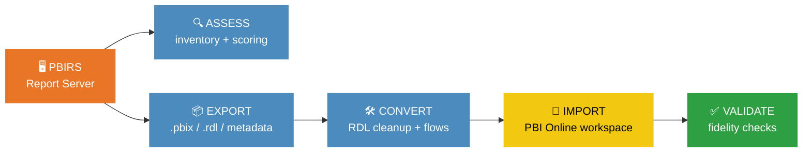

# 🔄 PBIRS → Power BI Online

**Automated Migration Tool** — migrate Power BI Report Server content to Power BI Online in 5 phases, fully automated, zero manual rework for compatible reports.

| | |
|---|---|
| 🏷️ **Version** | 1.7.0 |
| ✅ **Tests** | 513 passed · 24 test files |
| 🐍 **Python** | 3.12+ · zero external dependencies |
| 📜 **License** | MIT |

| 🎯 **Capabilities** | 11 content types · 9 assessment categories · 5-phase pipeline · 6 subscription converters |

---

## ⚡ Quick Start

```bash
# That's it. One command — full pipeline.
python migrate.py --server https://pbirs.company.com/reports --full --workspace-id <ID>
```

> [!TIP]
> Start with `--assess` to get an HTML readiness report before migrating anything.

<details>
<summary><b>📦 Installation</b></summary>

```bash
git clone <repo-url>
cd PBIReporttoPBIOnline
python migrate.py --server https://pbirs.company.com/reports --assess
```

**Requirements:** Python 3.12+ • No `pip install` needed — pure standard library.

Optional dependencies:
```bash
pip install azure-identity requests msal   # PBI Online deployment & Azure AD auth
```
</details>

### More ways to migrate

#### 📋 Assessment only

```bash
python migrate.py --server https://pbirs.company.com/reports --assess
python migrate.py --server https://pbirs.company.com/reports --assess --folder "/Sales Reports"
python migrate.py --server https://pbirs.company.com/reports --assess --content-types powerbi paginated
```

#### 📁 Phase-by-phase

```bash
# Export all content
python migrate.py --server https://pbirs.company.com/reports --export --output-dir artifacts/export

# Convert for PBI Online (strips custom code, resolves subreports, generates Power Automate flows)
python migrate.py --convert --input-dir artifacts/export --output-dir artifacts/converted

# Import to workspace
python migrate.py --import --input-dir artifacts/converted --workspace-id <WORKSPACE_ID>

# Validate deployed content
python migrate.py --validate --workspace-id <WORKSPACE_ID>
```

#### 🎯 Targeted migration

```bash
# Specific folder
python migrate.py --server URL --full --folder "/Finance" --workspace-id <ID>

# Content type filter
python migrate.py --server URL --full --content-types powerbi --workspace-id <ID>

# Include/exclude by pattern
python migrate.py --server URL --full --include-pattern "Sales.*" --workspace-id <ID>
```

#### ⚙️ Advanced options

```bash
# Dry run — preview all actions
python migrate.py --server URL --full --workspace-id <ID> --dry-run

# Parallel downloads (default: 4 workers)
python migrate.py --server URL --export --parallel 8

# With gateway binding
python migrate.py --import --input-dir artifacts/converted --workspace-id <ID> --map-gateway gateway_mapping.json

# Verbose logging to file
python migrate.py --server URL --full --workspace-id <ID> --verbose --log-file migration.log
```

---

## 🎯 Key Features

<table>
<tr>
<td width="50%">

### 🔍 Complete Extraction
Extracts **11 content types** from PBIRS via REST API v2.0:
Power BI reports, paginated reports, datasets, KPIs, mobile reports, linked reports, datasources, permissions, subscriptions, schedules, folder structure

</td>
<td width="50%">

### 📊 9-Category Assessment
Scores each item across **9 readiness categories**:
datasource compatibility, report complexity, security model, gateway requirements, paginated features, subscription migration, capacity requirements, data model, custom visuals

</td>
</tr>
<tr>
<td>

### 🧹 Automatic RDL Modification
Strips **unsupported features** from paginated reports:
custom VB.NET code, custom assemblies, custom classes — with change tracking and original backup

</td>
<td>

### 🔗 Subreport Resolution
Builds **dependency graph** and computes safe import order:
topological sort (Kahn's algorithm), circular dependency detection, orphan reference tracking

</td>
</tr>
<tr>
<td>

### ⚡ Power Automate Integration
Converts PBIRS subscriptions to **Power Automate flow definitions**:
email subscriptions, file-share→SharePoint, data-driven subscription stubs with query hints

</td>
<td>

### 🎯 Scorecard Generation
Maps PBIRS **KPI metadata** to PBI Online Scorecards/Goals:
value/goal/status expressions → Goals API payloads with suggested status rules

</td>
</tr>
<tr>
<td>

### 🔒 Security Model Migration
Maps **SSRS permissions** to PBI workspace roles:
Browser→Viewer, Content Manager→Admin, Publisher→Contributor, AD group enumeration, RLS detection

</td>
<td>

### 🚀 Deploy Anywhere
One-command deploy to **Power BI Service** or **Microsoft Fabric**:
Azure AD service principal / managed identity / device code flow

</td>
</tr>
<tr>
<td>

### ⏸️ Checkpoint & Resume
**Interrupted exports resume** from where they stopped:
atomic JSON checkpoint, per-item tracking, parallel-safe

</td>
<td>

### ↩️ Rollback Engine
Failed migrations can be **rolled back** automatically:
delete published content, restore original state, audit trail

</td>
</tr>
</table>

> [!NOTE]
> **Zero external dependencies** for core migration. The entire engine runs on Python's standard library.

---

## ⚙️ How It Works



**🔍 Phase 1 — Assess:** Inventories PBIRS content, scores readiness across 9 categories, generates HTML report

**📦 Phase 2 — Export:** Downloads content files (.pbix, .rdl, .rsd), extracts metadata (datasources, permissions, subscriptions, security)

**🛠️ Phase 3 — Convert:** Strips unsupported RDL features, resolves subreport dependencies, generates Power Automate flows, converts KPIs to Scorecards

**🚀 Phase 4 — Import:** Creates workspace, publishes reports/datasets, binds gateways, maps permissions, migrates subscriptions

**✅ Phase 5 — Validate:** Compares source vs target, checks bindings/refresh/permissions, generates migration report

---

## 📋 CLI Reference

### Connection
| Flag | Description |
|------|-------------|
| `--server URL` | PBIRS portal URL (e.g., `https://pbirs.company.com/reports`) |
| `--username USER` | PBIRS username |
| `--password PASS` | PBIRS password (or use `--token`) |
| `--token TOKEN` | Bearer token for PBIRS REST API |
| `--use-windows-auth` | Use current Windows credentials (NTLM/Kerberos) |

### Phases
| Flag | Description |
|------|-------------|
| `--assess` | Run assessment only (inventory + readiness) |
| `--export` | Export PBIRS content to local artifacts |
| `--convert` | Convert exported content for PBI Online |
| `--import` | Import converted content to PBI Online |
| `--validate` | Validate deployed content |
| `--full` | Run all 5 phases end-to-end |

### Output
| Flag | Description |
|------|-------------|
| `--output-dir DIR` | Output directory (default: `artifacts/`) |
| `--input-dir DIR` | Input directory for convert/import phases |
| `--workspace-id ID` | Target PBI Online workspace ID |
| `--workspace-name NAME` | Target workspace name (auto-creates if needed) |

### Filters
| Flag | Description |
|------|-------------|
| `--folder PATH` | Only migrate content from specific PBIRS folder |
| `--include-pattern REGEX` | Include items matching pattern |
| `--exclude-pattern REGEX` | Exclude items matching pattern |
| `--content-types TYPES` | Filter: `powerbi paginated dataset kpi` |

### Behavior
| Flag | Description |
|------|-------------|
| `--dry-run` | Preview without executing |
| `--verbose` | DEBUG-level logging |
| `--parallel N` | Parallel download workers (default: 4) |
| `--config FILE` | Load configuration from JSON file |
| `--skip-unsupported` | Skip unsupported items (default: true) |
| `--force-overwrite` | Overwrite existing items in target |
| `--map-gateway FILE` | Gateway mapping JSON file |
| `--log-file FILE` | Log output to file |

---

## 🔄 Content Type Mapping

| PBIRS Content | PBI Online Target | Requirements |
|---------------|-------------------|--------------|
| Power BI Reports (.pbix) | Power BI Reports | Standard workspace |
| Paginated Reports (.rdl) | Paginated Reports | Premium/PPU capacity |
| Shared Datasets (.rsd) | Semantic Models | Connection string update |
| KPIs | Scorecards / Goals | Auto-generated via `ScorecardGenerator` |
| Data Sources (.rds) | Gateway Connections | Gateway binding |
| Subscriptions (email) | PBI Subscriptions | Direct migration |
| Subscriptions (file share) | Power Automate flows | Auto-generated stubs |
| Subscriptions (data-driven) | Power Automate flows | Stubs with query hints |
| Linked Reports | Paginated Reports | Flatten hierarchy |
| Permissions (SSRS roles) | Workspace Roles + RLS | AD → Azure AD mapping |
| Mobile Reports | N/A (deprecated) | Flagged in assessment |
| Folders | Workspaces | Flat mapping |

---

## 📊 Assessment Scoring

### Per-Item (9 Categories)
1. **Datasource Compatibility** — On-prem vs cloud readiness
2. **Report Complexity** — Page/visual count, DAX complexity
3. **Security Model** — RLS/OLS/SSRS role mapping
4. **Gateway Requirements** — On-prem data gateway needs
5. **Paginated Features** — RDL feature support in PBI Online
6. **Subscription Migration** — Email/file-share/data-driven mapping
7. **Capacity Requirements** — Premium/PPU needs
8. **Data Model** — DirectQuery/Import/Composite compatibility
9. **Custom Visuals** — Org visual gallery mapping

### Portfolio Grading
- 🟢 **GREEN** — Fully compatible, direct migration
- 🟡 **YELLOW** — Minor adjustments needed (gateway rebinding, connection updates)
- 🔴 **RED** — Significant rework required (unsupported features, deprecated types)

---

## 🏗️ Architecture

See [docs/ARCHITECTURE.md](docs/ARCHITECTURE.md) for detailed module documentation.

```
PBIReporttoPBIOnline/
├── migrate.py                      # CLI entry point — 5-phase dispatcher
├── pbirs_export/                   # Phase 1-2: Assessment & Export
│   ├── api_client.py               #   PBIRS REST API v2.0 client
│   ├── assessment.py               #   9-category readiness assessment
│   ├── catalog_extractor.py        #   Catalog inventory extraction
│   ├── content_downloader.py       #   Parallel file download with checkpoint
│   ├── checkpoint.py               #   Resume-capable checkpoint manager
│   ├── progress.py                 #   Progress bar for long operations
│   ├── rdl_analyser.py             #   RDL feature analysis (custom code, assemblies, subreports)
│   ├── datasource_extractor.py     #   Datasource connection extraction
│   ├── permission_extractor.py     #   SSRS role & permission extraction
│   ├── subscription_extractor.py   #   Subscription & schedule extraction
│   ├── security_extractor.py       #   Security model & inheritance analysis
│   ├── mapping_generator.py        #   CSV mapping template generation
│   └── server_info.py              #   PBIRS server metadata
├── pbi_import/                     # Phase 3-5: Conversion, Import, Validation
│   ├── converter.py                #   Content conversion orchestrator
│   ├── rdl_modifier.py             #   Strip unsupported RDL features
│   ├── subreport_resolver.py       #   Dependency graph & import order
│   ├── power_automate_generator.py #   Subscription → Power Automate flows
│   ├── data_driven_converter.py    #   Data-driven subscription conversion
│   ├── scorecard_generator.py      #   KPI → Scorecard/Goals conversion
│   ├── workspace_manager.py        #   Workspace creation & management
│   ├── report_publisher.py         #   Power BI report publishing
│   ├── dataset_publisher.py        #   Dataset/semantic model publishing
│   ├── paginated_publisher.py      #   Paginated report publishing (Premium)
│   ├── gateway_mapper.py           #   Gateway datasource binding
│   ├── permission_mapper.py        #   SSRS → workspace role mapping
│   ├── security_converter.py       #   Security model conversion
│   ├── subscription_migrator.py    #   Subscription migration
│   ├── refresh_scheduler.py        #   Refresh schedule configuration
│   ├── validator.py                #   Post-migration validation
│   ├── migration_report.py         #   Migration report (HTML + JSON)
│   ├── rollback.py                 #   Rollback engine
│   └── deploy/                     #   Auth & API clients
│       ├── auth.py                 #     Azure AD / MSAL authentication
│       ├── pbi_client.py           #     PBI REST API wrapper
│       ├── fabric_client.py        #     Fabric REST API wrapper
│       └── config.py               #     Environment configuration
├── tests/                          # 152 tests across 20 files
├── scripts/                        # Utility scripts
├── docs/                           # Full documentation suite
└── examples/                       # Example configurations
```

---

## 🛠️ Technologies

- **Python 3.12+** — standard library only for core (no external dependencies)
- **PBIRS REST API v2.0** — content extraction
- **PBI REST API v1.0** / **Fabric REST API** — deployment
- **Optional deps:** `azure-identity`, `requests`, `msal` (deployment auth)

---

## 💡 Best Practices

- Run `--assess` first to understand migration scope and identify blockers
- Review the **gateway mapping** before running `--import`
- Test with `--folder` on a subset before full batch migration
- Use `--dry-run` to preview all actions before execution
- Keep PBIRS running during migration for validation comparison
- Check `rdl_analysis.json` for paginated reports needing custom code removal
