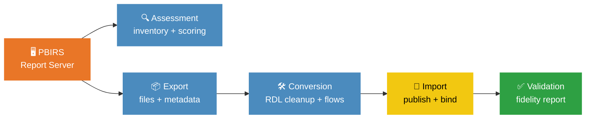

# 🏗️ Architecture

## Overview

**PBIRS-to-PBI-Online** migrates Power BI Report Server content to Power BI Online
through a 5-phase pipeline: **Assessment → Export → Conversion → Import → Validation**.

---

## ⚙️ Pipeline



**ASCII fallback:**

```
PBIRS ──► [Assessment] ──► [Export] ──► [Conversion] ──► [Import] ──► [Validation]
              │                │              │              │              │
         inventory.json   .pbix/.rdl     rdl_cleaned/    workspace     report.html
         readiness.html   metadata/      flows.json      deployed      fidelity
```

### Phase 1 — Assessment
- Connect to PBIRS REST API v2.0
- Inventory all content (Power BI reports, paginated reports, datasets, KPIs)
- Score each item across **9 readiness categories**
- Assign GREEN/YELLOW/RED grades and plan migration waves
- Generate HTML assessment report

### Phase 2 — Export
- Download content files (.pbix, .rdl, .rsd) — parallel with checkpoint/resume
- Extract metadata: datasources, permissions, subscriptions, schedules, security
- Analyze RDL features (custom code, assemblies, subreports)
- Generate CSV mapping templates
- Preserve folder structure in output directory

### Phase 3 — Conversion
- Strip unsupported RDL features (custom VB code, assemblies, custom classes)
- Resolve subreport dependencies (topological sort, circular detection)
- Generate Power Automate flow definitions for unsupported subscriptions
- Convert data-driven subscriptions with query hints and CSV templates
- Convert KPI metadata to Scorecard/Goals API payloads

### Phase 4 — Import
- Create/verify PBI Online workspace
- Publish Power BI reports (.pbix) via PBI REST API
- Publish paginated reports (.rdl) to Premium/PPU workspace
- Bind datasets to on-premises data gateway
- Map SSRS permissions to workspace roles
- Migrate email subscriptions and refresh schedules

### Phase 5 — Validation
- Compare source catalog with PBI Online workspace
- Validate report count, datasource bindings, refresh schedules, permissions
- Generate migration report (HTML + JSON)
- Provide PASS/WARN/FAIL status per item

---

## 📦 Module Responsibilities

### `pbirs_export/` — Extraction Layer

| Module | Responsibility |
|--------|---------------|
| `api_client.py` | PBIRS REST API v2.0 client (Basic/Bearer/NTLM auth, all endpoints) |
| `assessment.py` | 9-category migration readiness assessment with GREEN/YELLOW/RED grading |
| `catalog_extractor.py` | Catalog inventory extraction (folders, content items, metadata) |
| `content_downloader.py` | Parallel content file download (.pbix, .rdl, .rsd) with checkpoint integration |
| `checkpoint.py` | Atomic JSON checkpoint — resume interrupted exports |
| `progress.py` | Progress bar for long-running operations |
| `rdl_analyser.py` | RDL feature analysis — detect custom code, assemblies, subreports, datasources, parameters |
| `datasource_extractor.py` | Datasource connection string and type extraction |
| `permission_extractor.py` | SSRS role and per-item permission extraction |
| `subscription_extractor.py` | Subscription and schedule extraction (email, file-share, data-driven) |
| `security_extractor.py` | Security model analysis — AD group enumeration, inheritance, role composition |
| `mapping_generator.py` | CSV mapping template generation (gateway, permission, datasource, workspace) |
| `server_info.py` | PBIRS server version and configuration metadata |

### `pbi_import/` — Generation & Deployment Layer

| Module | Responsibility |
|--------|---------------|
| `converter.py` | Content conversion orchestrator (PBIRS → PBI Online) |
| `rdl_modifier.py` | Strip unsupported RDL features (custom code, assemblies, classes) with backup |
| `subreport_resolver.py` | Dependency graph + topological sort — safe import order, circular detection, orphan refs |
| `power_automate_generator.py` | Subscription → Power Automate flow definitions (email, file-share, data-driven) |
| `data_driven_converter.py` | Data-driven subscription conversion plans + CSV templates |
| `scorecard_generator.py` | KPI metadata → PBI Scorecard/Goals API payloads |
| `workspace_manager.py` | Workspace creation, capacity assignment, existence checks |
| `report_publisher.py` | Power BI report (.pbix) upload and publishing |
| `dataset_publisher.py` | Dataset/semantic model publishing and binding |
| `paginated_publisher.py` | Paginated report (.rdl) publishing to Premium workspace |
| `gateway_mapper.py` | Gateway datasource binding from mapping file |
| `permission_mapper.py` | SSRS roles → PBI workspace roles (Browser→Viewer, etc.) |
| `security_converter.py` | Security model conversion (RLS generation, group mapping) |
| `subscription_migrator.py` | Email subscription migration via PBI REST API |
| `refresh_scheduler.py` | Dataset refresh schedule configuration |
| `validator.py` | Post-migration validation (count, bindings, permissions) |
| `migration_report.py` | HTML + JSON migration fidelity report |
| `rollback.py` | Rollback engine — delete published content on failure |

### `pbi_import/deploy/` — Authentication & API Clients

| Module | Responsibility |
|--------|---------------|
| `auth.py` | Azure AD authentication (Service Principal, Managed Identity, Device Code) |
| `pbi_client.py` | Power BI REST API v1.0 wrapper |
| `fabric_client.py` | Microsoft Fabric REST API wrapper |
| `config.py` | Environment configuration (env vars, .env file) |

---

## 🔄 Data Flow Detail

### Step 1: Assessment & Export

```
PBIRS REST API v2.0
        │
        ├── api_client.py ─── GET /CatalogItems, /PowerBIReports, /Reports, etc.
        │
        ├── catalog_extractor.py → inventory.json
        │
        ├── assessment.py → readiness.html (9 categories × N items)
        │
        ├── content_downloader.py → .pbix / .rdl / .rsd files (parallel)
        │   └── checkpoint.py → checkpoint.json (resume state)
        │
        ├── rdl_analyser.py → rdl_analysis.json (custom code/assembly detection)
        │
        ├── datasource_extractor.py → datasources.json
        ├── permission_extractor.py → permissions.json
        ├── subscription_extractor.py → subscriptions.json
        ├── security_extractor.py → security_model.json
        └── mapping_generator.py → gateway_mapping.csv, permission_mapping.csv, ...
```

### Step 2: Conversion

```
Exported artifacts
        │
        ├── rdl_modifier.py → stripped .rdl files (backup originals)
        │
        ├── subreport_resolver.py → import_order[], circular[], orphan_refs[]
        │
        ├── power_automate_generator.py → power_automate_flows.json
        │   ├── email subscriptions → email flow definitions
        │   ├── file-share → SharePoint flow definitions
        │   └── data-driven → flow stubs with query hints
        │
        ├── data_driven_converter.py → conversion_plans[], csv_templates[]
        │
        └── scorecard_generator.py → scorecards.json (Goals API payloads)
```

### Step 3: Import & Validation

```
Converted artifacts
        │
        ├── workspace_manager.py → create/verify PBI workspace
        │
        ├── report_publisher.py → POST /imports (Power BI reports)
        ├── dataset_publisher.py → POST /imports (datasets)
        ├── paginated_publisher.py → POST /imports (paginated reports)
        │
        ├── gateway_mapper.py → PATCH /datasets/{id}/Default.BindToGateway
        ├── permission_mapper.py → POST /groups/{id}/users
        ├── subscription_migrator.py → POST /reports/{id}/subscriptions
        ├── refresh_scheduler.py → PATCH /datasets/{id}/refreshSchedule
        │
        └── validator.py → migration_report.html + migration_report.json
```

---

## 🔒 Authentication

| Direction | Protocol | Methods |
|-----------|----------|---------|
| **PBIRS** (source) | REST API v2.0 | Basic, Bearer token, Windows (NTLM/Kerberos) |
| **PBI Online** (target) | REST API v1.0 | Azure AD Service Principal, Managed Identity, Device Code |
| **Fabric** (target) | REST API v1 | Azure AD Service Principal, Managed Identity |

---

## 🔄 Content Type Mapping

| PBIRS Type | PBI Online Equivalent | Requirements |
|------------|----------------------|--------------|
| PowerBIReport | Power BI Report | Standard workspace |
| Report (RDL) | Paginated Report | Premium/PPU capacity |
| LinkedReport | Paginated Report | Premium/PPU capacity |
| DataSet | Semantic Model | Embedded in .pbix |
| Kpi | Scorecard / Goals | Via `ScorecardGenerator` |
| MobileReport | N/A (deprecated) | Not migratable |
| DataSource | Gateway Datasource | Gateway configuration |
| Folder | Workspace (flat) | PBI has no nested folders |
